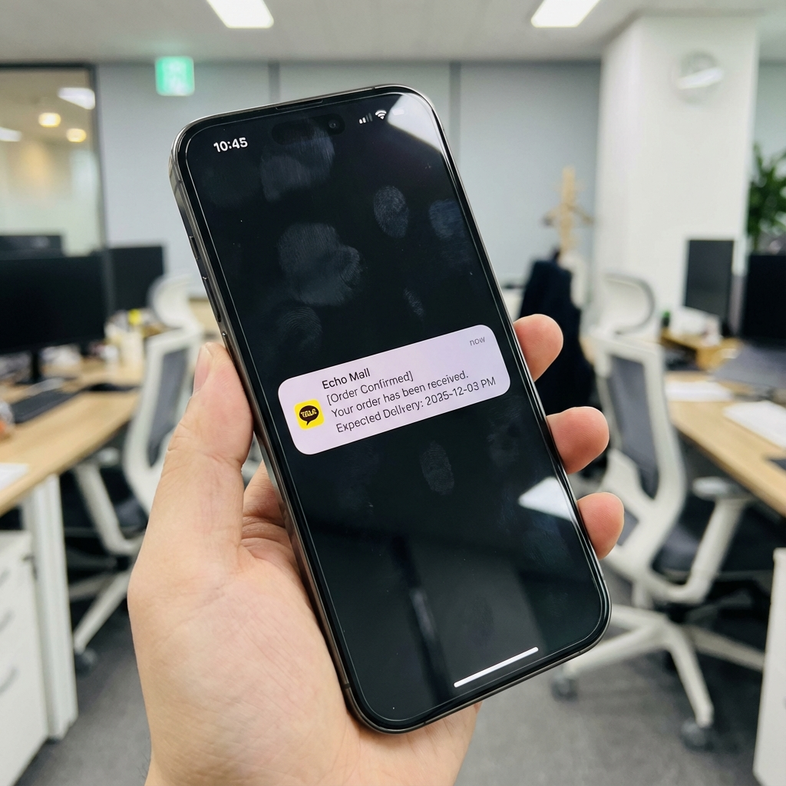
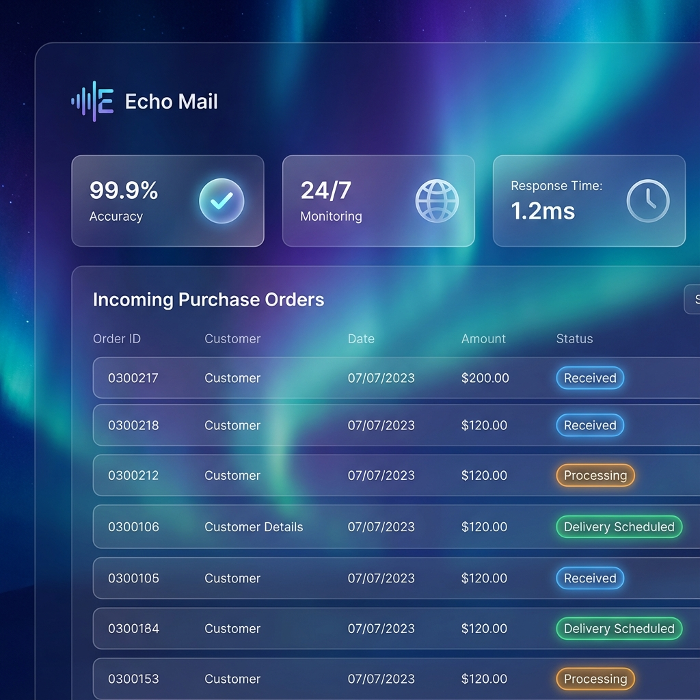

# 🚀 Echo Mail: B2B 발주 업무 자동화 솔루션
## Investment Pitch Deck

---

### 1. Problem (문제점)
**"단순 전화 업무가 회사의 성장을 가로막고 있습니다."**

- **Pain Point:** 중소 제조/유통 기업의 영업지원팀은 하루 평균 **2시간 이상**을 단순 발주 확인 전화 응대에 사용합니다.
- **Inefficiency:** 
    - "제 메일 보셨나요?" (하루 30통+)
    - "언제 도착하나요?" (하루 20통+)
    - 담당자 부재 시 업무 마비 및 휴먼 에러 발생 가능성.
- **Cost:** 직원 1명당 월 **50시간** 낭비 = 연간 약 **1,000만 원**의 보이지 않는 손실 발생.

---

### 2. Solution (해결책)
**"메일이 오면, 카톡이 갑니다. 1초 만에."**

Echo Mail은 복잡한 설치 없이, 기존 이메일 시스템에 연동되어 **발주 접수부터 납기 안내까지 전 과정을 자동화**합니다.

#### ✅ 핵심 프로세스
1. **자동 감지:** 거래처에서 발주 메일 발송 📧
2. **AI 분석:** Echo Mail이 메일 내용 및 첨부파일 분석 🤖
3. **즉시 알림:** 담당자에게 카카오톡/문자로 "접수 완료 & 납기일" 발송 📱

*(실제 알림 발송 예시 화면)*

---

### 3. Product (제품 소개)
**"누구나 쉽게 쓰는 직관적인 대시보드"**

복잡한 ERP 교육이 필요 없습니다. 관리자는 대시보드에서 실시간으로 발송 현황을 모니터링하고, 거래처별 맞춤 설정을 할 수 있습니다.

*(Echo Mail 관리자 대시보드 메인 화면)*

#### 🔑 Key Features
- **Smart Parsing:** 정해진 양식이 없어도 키워드와 패턴으로 발주 메일 인식.
- **Auto-Scheduling:** 지역별 배송 루트와 공휴일을 고려하여 **정확한 납품 예정일** 자동 계산.
- **Multi-Channel:** 카카오톡 알림톡, 문자(SMS/LMS) 모두 지원.

---

### 4. Market & Business Model (시장 및 수익 모델)

#### 🎯 Target Market
- **1차 타겟:** 건자재, 철강, 식자재 등 **전화/메일 발주 비중이 높은** 중소 유통사.
- **시장 규모:** 국내 중소 제조/도매업체 약 20만 개 * 월 구독료 5만 원 = **연 1,200억 원** 규모의 초기 시장.

#### 💰 Business Model (SaaS)
- **Basic (월 49,000원):** 월 1,000건 발송, 기본 대시보드.
- **Pro (월 99,000원):** 무제한 발송, AI 정밀 분석, 전담 매니저 지원.
- **Enterprise (별도 문의):** ERP 연동 및 커스텀 기능 개발.

---

### 5. Traction & Roadmap (성과 및 계획)

#### 🏆 Current Status (현재 상태)
- **MVP 개발 완료:** 메일 수신 → 파싱 → 알림 발송 핵심 로직 구현 완료.
- **안정성 확보:** 99.9% 가동률의 서버 아키텍처 구축 (Next.js, Supabase, Redis).

#### 🗺️ Future Roadmap (향후 계획)
- **Q3 2025 (고도화):** 
    - 팩스(Fax) 발주서 자동 인식 (OCR) 기능 추가.
    - 거래처별 전용 주문 포털 제공.
- **Q4 2025 (확장):** 
    - 주요 ERP (더존, 이카운트) API 연동.
    - AI 기반 수요 예측 및 재고 경고 기능.

---

### 6. Ask (제안)
**"Echo Mail과 함께 B2B 업무 혁신을 이끌 파트너를 찾습니다."**

저희는 단순한 알림 서비스를 넘어, **중소기업의 디지털 전환(DX)을 돕는 필수 솔루션**이 되고자 합니다. 
지금, 가장 확실한 B2B 자동화 시장에 투자하세요.

---
*Contact: [Your Name / Email / Phone]*
